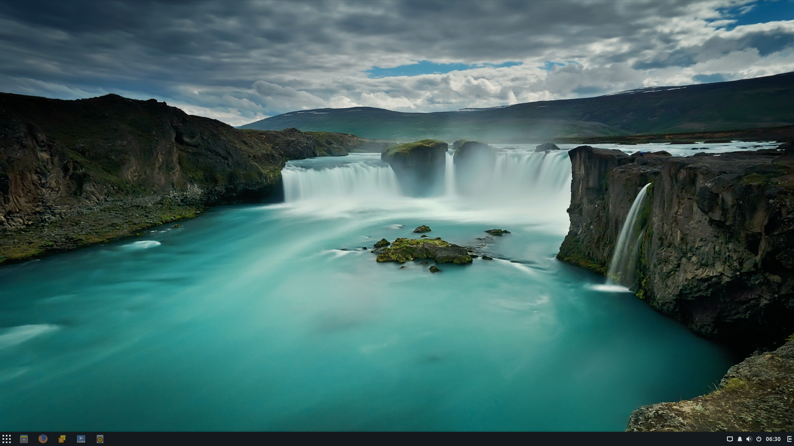
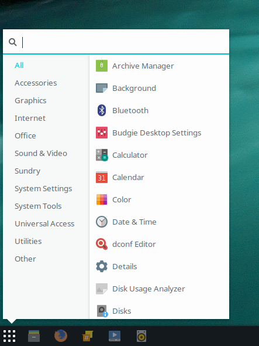
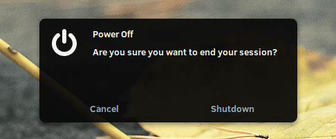
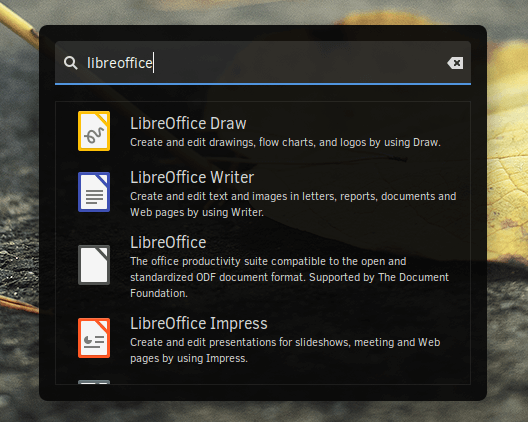
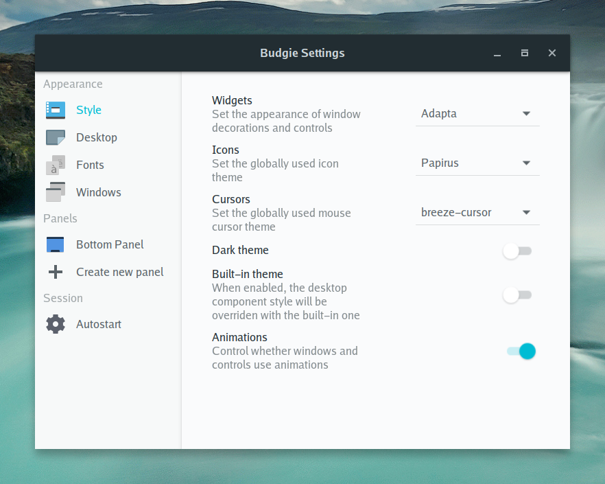
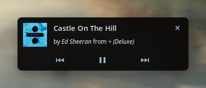

budgie-desktop
==============

Budgie is a modern desktop environment (DE) for Linux, designed to assist the user without obstruction or interference. It is heavily integrated with the GNOME stack for an enhanced experience.




IRC: #budgie-desktop-dev on irc.freenode.net

Components
==========

Budgie Desktop consists of a number of components to provide a complete desktop environment.

Budgie Menu
---------

The main menu provides a quick and easy to use menu, suitable for both mouse and keyboard driven users. Features as-you-type search and category based filtering.



End Session Dialog
------------------

The session dialog provides the usual shutdown, logout, options which can be activated using the User Indicator applet.



Run Dialog
----------

The run dialog provides the means to quickly find an application in a popup window. This window by default is activated with the `ALT+F2` keyboard shortcut, providing keyboard driven launcher facilities.



Budgie Settings
---------------

Budgie Desktop Settings provides easy changes to the appearance of GTK decorations, icons, and cursors; fonts; window button layouts; panels for different applets (budgie menu, clock, task list, raven, workspace switcher, etc.); and autostart applications as well as autostart commands.



Raven
------

Raven provides an all-in-one center for the Budgie Desktop. With built in applets (including media integration with all MPRIS compliant media players) and a notification center to archive missed notifications.

Applets
-------

Raven's applets include a calendar, easy to switch audio/mic outputs and inputs, and media player controls. The media player supports cover artwork, global media key support for keyboards, and closing the media player itself.


Notifications
-------------

Budgie Desktop supports the freedesktop notifications specification, enabling applications to send visual alerts to the user. These notifications support actions, icons, as well as passive modes.



To ensure the user doesn't miss the notification, it's automatically archived into the Raven Notification view for quick and easy access.


PolicyKit integration
---------------------

The `budgie-polkit-dialog` provides a PolicyKit agent for the session, ensuring a cohesive and integrated experience whilst authenticating for actions on modern Linux desktop systems.


Testing
------

As and when new features are implemented - it can be helpful to reset the configuration to the defaults to ensure everything is still working ok. To reset the entire configuration tree, issue:

```bash
budgie-panel --reset --replace &
```

License
-------

budgie-desktop is available under a split license model. This enables
developers to link against the libraries of budgie-desktop without
affecting their choice of license and distribution.

The shared libraries are available under the terms of the LGPL-2.1,
allowing developers to link against the API without any issue, and
to use all exposed APIs without affecting their project license.

The remainder of the project (i.e. installed binaries) is available
under the terms of the GPL 2.0 license. This is clarified in the headers
of each source file.

Authors
=======

Copyright © 2014-2017 Budgie Desktop Developers

Budgie Desktop is primarily authored by the [Solus](https://solus-project.com) project which oversees
the development and leadership of the Budgie Desktop to ensure the delivery of a distribution agnostic
and open source Desktop Environment for everyone to enjoy and contribute to.

See our [contributors graph](https://github.com/solus-project/budgie-desktop/graphs/contributors)!
